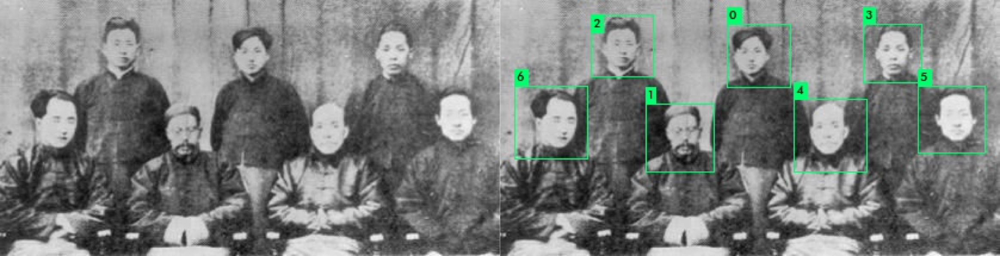

#                            Guidance
###                            V1.0 20180709
## It is recommended to use GPU for faster detecting.
### 1.
If you want to use pre-built shared lib, you need a machine with a competent GPU, equipped with cudnn 5, OpenCV 3.

### 2.
Else, you have to build your own shared lib. Modify the parameters in "Makefile" consider your situation, the build parameters including GPU, CUDNN, OPENCV, and OPENMP.

### 3.
After modifications in Makefile, type
```shell
make -j20
```
or something else to build the lib file.

### 4.
If there are no error on your screen, congratulations, then
```shell
gcc ./face_detector.c -g -o facedetector ./libdarknet.so
```
to build the executable file.

### 5.
Try
```shell
./facedetector single path_to_your_image_to_be_test threshold
```

